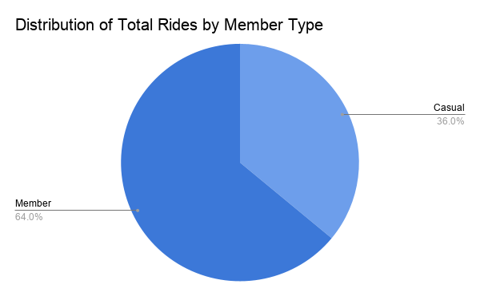
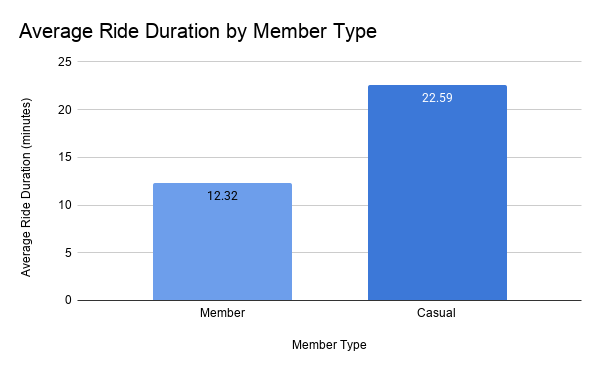
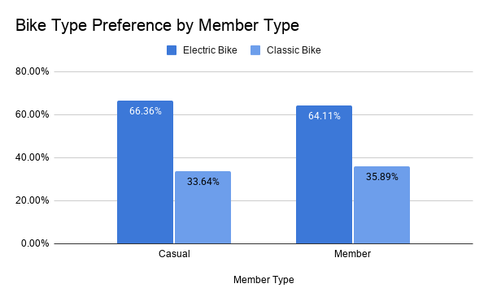
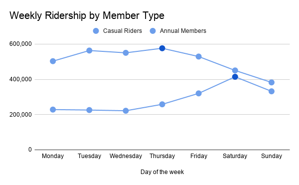
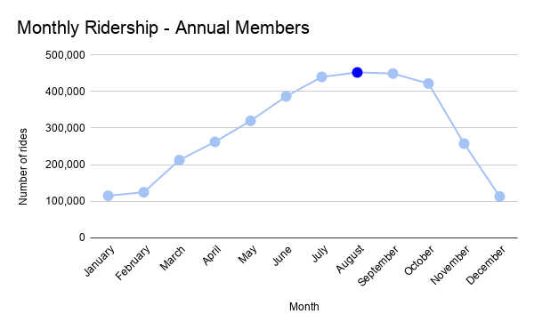
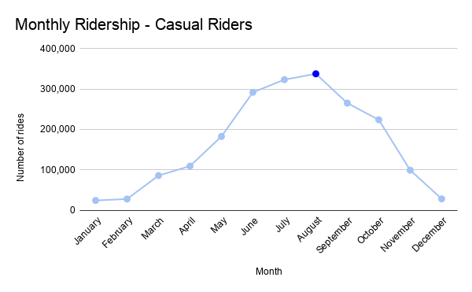
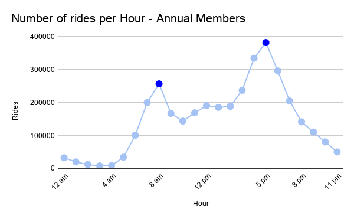
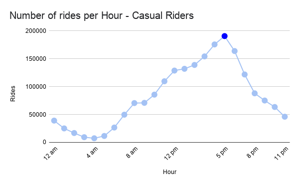
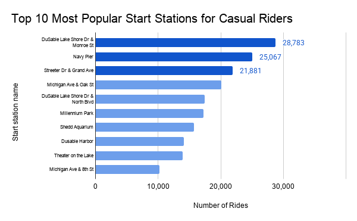

# Cyclistic Bike-Share Case Study

## Project Overview

This project was completed as part of the Google Data Analytics Professional Certificate.

The objective of this analysis is to understand how annual members and casual riders use Cyclistic bikes differently and provide data-driven recommendations to increase annual memberships.

---

## Business Task

Analyze the behavioral differences between casual riders and annual members to support the marketing team in designing strategies that convert casual riders into annual members.

---

## Tools Used

- SQL (Google BigQuery)
- Google Sheets
- Data Cleaning
- Data Visualization
- Business Analysis

---

## Dataset

The dataset consists of 12 months of public Divvy bike trip data from 2025.

Source:
https://divvy-tripdata.s3.amazonaws.com/index.html

---

## Data Cleaning

The following data quality checks were performed:

- Combined 12 monthly datasets into one table.
- Checked duplicate ride IDs.
- Investigated missing values.
- Flagged invalid ride durations.
- Flagged rides longer than 24 hours.
- Created new variables for analysis (ride length, month, weekday, hour, etc.).

---

## Key Findings

- Annual members completed significantly more rides than casual riders.
- Casual riders spent almost twice as much time per ride.
- Both groups preferred electric bikes.
- Annual members mainly rode during weekdays and commuting hours.
- Casual riders were more active during weekends and afternoons.
- Ridership peaked during the summer months.
- Casual riders frequently started trips at tourist and waterfront stations.

---

## Business Recommendations

1. Launch seasonal membership campaigns during summer.
2. Promote memberships at popular casual rider stations.
3. Emphasize cost savings for frequent riders.

---

## Visualizations

### Total Rides by Member Type



### Average Ride Duration



### Bike Type Preference



### Weekly Ridership



### Monthly Ridership - Annual Members



### Monthly Ridership - Casual Riders



### Hourly Ridership - Annual Members



### Hourly Ridership - Casual Riders



### Top 10 Most Popular Start Stations for Casual Riders



---

## Repository Structure

```text
Cyclistic-bike-share-case-study
│
├── README.md
├── LICENSE
├── sql/
│   └── analysis_queries.sql
└── images/
    ├── total_rides.png
    ├── average_duration.png
    ├── bike_type.png
    ├── weekday_rides.png
    ├── monthly_members.png
    ├── monthly_casual.png
    ├── hourly_members.png
    └── top10_stations.png
```
---

## Author

Victoria Davila
